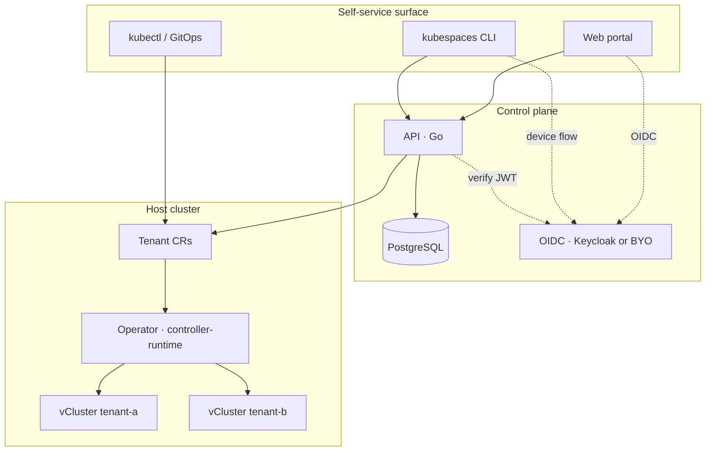

# Architecture

KubeSpaces is four components and one rule: **the `Tenant` custom resource
is the source of truth, and the operator is the only thing that provisions.**

## The components

**API** (Go — chi, pgx, go-oidc). Authenticates every request against your
OIDC issuer, enforces ownership (you see your tenants; foreign tenants are a
404, not a 403), persists metadata and an audit log to PostgreSQL, and
translates REST calls into `Tenant` CRs. It holds the narrowest possible
RBAC: CRUD on Tenants, read on kubeconfig Secrets.

**Operator** (Go — controller-runtime). Watches cluster-scoped `Tenant` CRs
and reconciles each into: namespace → quota + limits → vCluster (via the
Helm SDK, from the pinned chart mirror) → network routes → status. Teardown
runs through a finalizer, so a deleted CR always means a fully cleaned-up
tenant. The operator never talks to the API or the database.

**Portal** (Next.js + Auth.js). Self-service UI over the API. OIDC tokens
never reach the browser — a server-side proxy holds them.

**CLI** (`kubespaces`, Go — cobra). OIDC device flow, tenant CRUD,
`tenant kubeconfig --merge`. Same API, same permissions as the portal.

## Why this shape ("Pattern B")

The API *could* provision vClusters directly. It deliberately does not:

- **One provisioning path.** Whether a tenant comes from the portal, the
  CLI, `kubectl apply` or an Argo pipeline, the exact same reconciliation
  runs. There is no drift between "UI tenants" and "GitOps tenants".
- **Level-triggered recovery.** The operator reconciles state, not events —
  it survives restarts, missed webhooks and half-finished provisions the way
  every healthy Kubernetes controller does.
- **Privilege separation.** The API cannot create workloads; the operator
  cannot read user data. A compromised portal cannot mint cluster-admin.
- **The database is not the truth.** PostgreSQL stores ownership metadata
  and audit history. If it burned down, every tenant would keep running and
  the CRs would still describe them completely.

## The tenant boundary

Each tenant is a [vCluster](https://github.com/loft-sh/vcluster): a real
API server + controller manager running *as pods* in the tenant's host
namespace, syncing selected resources down to the host. Tenants get their
own CRDs, RBAC, namespaces and admission control; the host sees one
namespace with a quota on it.

KubeSpaces treats vCluster as an implementation detail behind the
provisioner interface — the chart is pinned and mirrored
(`oci://ghcr.io/kubespaces-io/charts/vcluster`), versions are upgraded
deliberately, and alternative backends (e.g. k3k) are periodically
evaluated. See [decision D16](https://github.com/kubespaces-io/kubespaces/issues/15)
context in the repo's decision log.

## Trust boundaries, in one table

| Actor | Can | Cannot |
|---|---|---|
| Tenant user | anything inside their vCluster; create HTTPRoutes that expose apps under `*.{tenant}.apps.{domain}` | touch the host, other tenants, other tenants' hostnames, or the API gateway |
| API | CRUD Tenants, read kubeconfig Secrets | create workloads, escalate RBAC |
| Operator | provision namespaces/quotas/vClusters/routes | read the database, mint credentials for users |
| Host admin | everything | — (that's you) |

The networking half of the isolation story — SNI passthrough, per-tenant
listeners, structural hostname isolation — has
[its own page](networking.md).
