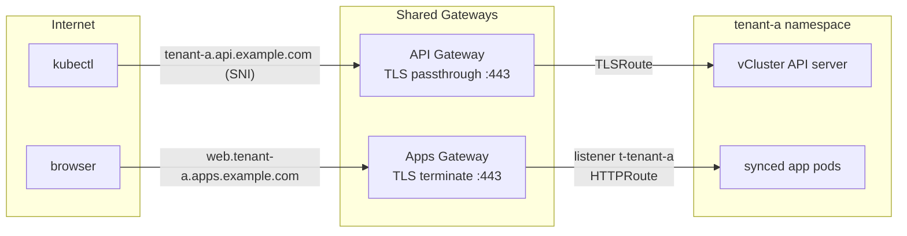

# Networking

Two shared Gateways carry all tenant traffic. The operator automates every
per-tenant object; the platform admin sets up the Gateways once
([Host cluster preparation](../host-cluster.md)).

## The API path: passthrough, not termination

Tenant API servers are exposed at `https://<tenant>.api.<domain>` through a
**TLS passthrough** listener: the Gateway routes on the SNI header and
forwards the still-encrypted stream to the tenant's vCluster Service.

Consequences worth understanding:

- **End-to-end TLS.** Clients terminate against vCluster's own serving
  certificate — the platform never holds tenant API traffic in plaintext,
  and client-certificate kubeconfigs keep working (a terminating proxy
  would break them).
- **No cert-manager on this path.** The operator injects the public
  hostname into the vCluster certificate SANs
  (`controlPlane.proxy.extraSANs`) and points the exported kubeconfig at
  the public URL (`exportKubeConfig.server`) — the kubeconfig you download
  simply works, from anywhere.
- **Per tenant, the operator creates**: a `TLSRoute` in the gateway
  namespace (with external-dns annotations) and a `ReferenceGrant` in the
  tenant namespace. `status.apiServerUrl` reports the endpoint.

The API gateway admits routes **only from its own namespace**
(`allowedRoutes: Same`) — the namespace only the operator writes to. Tenants
cannot attach anything to it, by construction.

## The apps path: one listener per tenant

Tenant workloads are exposed at `https://<app>.<tenant>.apps.<domain>`
through the apps Gateway. Here TLS *is* terminated — browsers need real
certificates — and the unit of isolation is the **listener**:

Per tenant, the operator manages:

- a cert-manager **Certificate** for `*.<tenant>.apps.<domain>` (wildcard
  certs cover exactly one DNS label, which is why each tenant needs its own)
- a **listener** `t-<tenant>` on the shared Gateway: that hostname, that
  certificate, and `allowedRoutes` restricted to namespaces labeled
  `kubespaces.io/tenant=<tenant>` — i.e. exactly one namespace
- vCluster's **native Gateway API sync**: `HTTPRoute`s created inside the
  tenant materialize in its host namespace, and the shared Gateway is
  projected into the tenant's `default` namespace so users reference it
  without knowing any host topology

## Why hostname theft is structurally impossible

No admission policy, no webhook — the Gateway API semantics are the guard:

1. A tenant's synced routes land in **its** host namespace.
2. The only listener that admits routes from that namespace is the
   tenant's own.
3. That listener's hostname is `*.<tenant>.apps.<domain>` — a route claiming
   another tenant's hostname has no intersection with it and is rejected
   (`NoMatchingListenerHostname`).
4. TLSRoute sync is disabled, and the API gateway admits no tenant routes at
   all.

This is verified adversarially in the E2E suite: a route claiming a foreign
hostname is rejected and its SNI never reaches a listener.

## DNS

Two wildcard records cover every tenant forever:

| Record | Points at | Covers |
|---|---|---|
| `*.api.<domain>` | API Gateway IP | `<tenant>.api.<domain>` |
| `*.apps.<domain>` | Apps Gateway IP | `<app>.<tenant>.apps.<domain>` (DNS wildcards match multiple labels) |

Alternatively run external-dns: the operator annotates every TLSRoute with
`external-dns.alpha.kubernetes.io/hostname` (plus an optional target
override for on-prem gateways), and records appear per tenant.

## Limits and roadmap

- Gateway API caps a Gateway at **64 listeners** — beyond roughly 60
  tenants, shard app exposure across a second apps Gateway.
- Tenant HTTPRoutes must live in the tenant's virtual `default` namespace
  (the Gateway is projected into exactly one namespace).
- Per-tenant NetworkPolicy (default-deny toward host services) is scheduled
  for the hardening milestone — see the
  [roadmap](https://github.com/kubespaces-io/kubespaces/blob/main/ROADMAP.md).
