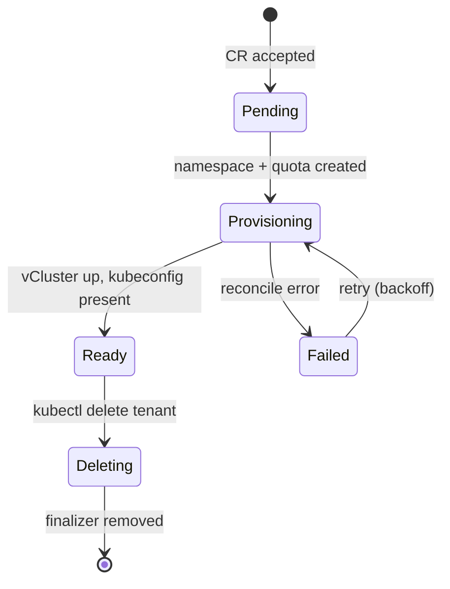

# Tenant lifecycle

A `Tenant` is a cluster-scoped custom resource (`kubespaces.io/v1alpha1`).
This page describes what the operator does with one; the field-by-field
reference is [Tenant CRD](../reference/tenant-crd.md).

## Phases

`status.phase` is the coarse signal; `status.conditions` (a standard
`Ready` condition with reasons like `Provisioning`, `Provisioned`,
`QuotaFailed`, `NetworkingFailed`) carries the detail, and
`status.message` says it in words.

## What one reconcile pass ensures

Order matters and every step is idempotent:

1. **Finalizer** (`kubespaces.io/finalizer`) — added first, so teardown can
   never be skipped.
2. **Namespace** — `spec.targetNamespace` or `kubespaces-tenant-<name>`,
   labeled `kubespaces.io/tenant=<name>` (this label is what network
   isolation keys on).
3. **ResourceQuota** — from `spec.resources` (cpu/memory become both
   `requests.*` and `limits.*`; storage becomes `requests.storage`).
4. **LimitRange** — container defaults (1 CPU / 1Gi limit, 100m / 128Mi
   request) so pods that declare no limits — including vCluster's own
   syncer — still schedule under a limits-bearing quota.
5. **Networking** (when configured) — TLSRoute + ReferenceGrant for the API
   endpoint; apps listener + certificate. See [Networking](networking.md).
6. **vCluster** — Helm install/upgrade from the pinned mirror, with the
   tenant's Kubernetes version, values overrides, and (when exposed) the
   public hostname baked into the cert SANs and exported kubeconfig.
7. **Status** — phase, conditions, `kubeconfigSecretRef`, `apiServerUrl`,
   `appsDomain`, `observedGeneration`.

Readiness is real, not cosmetic: `Ready` requires the vCluster workload to
report ready **and** the kubeconfig Secret to exist with the right key.

## Deletion

`kubectl delete tenant <name>` flips the phase to `Deleting` and the
finalizer runs the teardown: Helm uninstall of the vCluster, removal of the
cross-namespace networking objects (the TLSRoute and apps listener live in
the gateway namespace, where namespace deletion cannot collect them), the
per-tenant certificate and its secret, then the namespace itself. Only after
all of that does the finalizer come off and the CR disappear. A failed
teardown keeps the finalizer and retries — tenants do not leak.

## Quotas in practice

The quota constrains the tenant's **total host footprint** — every pod the
vCluster syncs down counts against it. Inside the tenant, users can create
their own ResourceQuotas per namespace as on any cluster; the host quota is
the outer wall. Pods rejected with `must specify limits.cpu` are the classic
symptom of a quota without a LimitRange — which is exactly why the operator
always pairs them.

## Customizing the virtual cluster

`spec.vcluster` carries the escape hatches: `version` (chart version),
`kubernetesVersion` (the API server inside), and `valuesOverrides` — raw
vCluster chart values merged over the operator's defaults (overrides win).

!!! warning
    `valuesOverrides` is admin-grade power (it can disable sync guards or
    change isolation settings). A policy guard restricting which overrides
    self-service users may set is on the
    [roadmap](https://github.com/kubespaces-io/kubespaces/blob/main/ROADMAP.md)
    for the hardening milestone.
