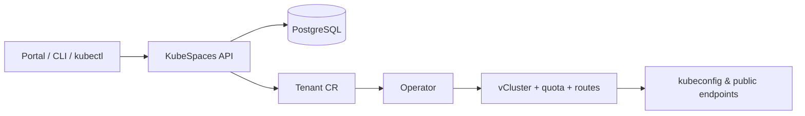

# KubeSpaces

**The open control plane for virtual Kubernetes tenants.** KubeSpaces turns
one Kubernetes cluster into many: self-service, isolated virtual clusters
("tenants") with real kubeconfigs, resource quotas, public API endpoints and
app URLs — Tenant as a Service, on your own infrastructure, Apache 2.0.

```bash
git clone https://github.com/kubespaces-io/kubespaces && cd kubespaces
helm install kubespaces charts/kubespaces -n kubespaces --create-namespace
kubespaces tenant create team-atlas --cpu 8 --memory 16Gi
kubespaces tenant kubeconfig team-atlas --merge
kubectl get nodes   # a real cluster, minutes later
```

## What you get

- **A tenant is a cluster.** Each tenant gets a [vCluster](https://github.com/loft-sh/vcluster)
  — its own API server, CRDs, RBAC and namespaces — not a shared namespace
  with guardrails.
- **Self-service, three ways.** Web portal, `kubespaces` CLI (OIDC device
  flow), or plain `kubectl apply` of a `Tenant` custom resource. All three
  converge on the same declarative object.
- **Reachable from anywhere.** Tenant API servers at
  `https://<tenant>.api.<domain>` (TLS passthrough, end-to-end encrypted) and
  tenant apps at `https://<app>.<tenant>.apps.<domain>` with per-tenant
  certificates — automated by the operator, isolated by construction.
- **Quotas that hold.** Per-tenant ResourceQuota + LimitRange on the host,
  enforced below the tenant's own admission control.
- **Boring, auditable supply chain.** CI-built images signed with cosign,
  SBOMs on every artifact, a pinned and mirrored vCluster chart, and a
  [documented security posture](security.md).

## Where to start

| You want to… | Go to |
|---|---|
| Try it in 10 minutes on kind | [Quickstart](getting-started/quickstart.md) |
| Install it properly | [Prerequisites](prerequisites.md) → [Installation](getting-started/installation.md) |
| Give tenants public endpoints | [Host cluster preparation](host-cluster.md) |
| Understand how it works | [Architecture](concepts/architecture.md) |
| Look something up | [Tenant CRD](reference/tenant-crd.md) · [Chart values](reference/chart-values.md) |

## How it fits together



The API authenticates users (any OIDC provider; Keycloak ships in the box),
persists metadata and audit history, and writes cluster-scoped `Tenant`
custom resources. The operator is the **sole provisioner**: it reconciles
each `Tenant` into a namespace, quotas, a vCluster and its network routes.
The CR is the source of truth — which is why `kubectl apply` and GitOps
pipelines are first-class tenants too. More in
[Architecture](concepts/architecture.md).

## Project

KubeSpaces is open source under Apache 2.0, built in the open by
[@ams0](https://github.com/ams0). Code, issues and the public roadmap live in
the [monorepo](https://github.com/kubespaces-io/kubespaces); progress is
tracked on the [project board](https://github.com/orgs/kubespaces-io/projects/3).
Security disclosures: see [SECURITY.md](https://github.com/kubespaces-io/kubespaces/blob/main/SECURITY.md).
